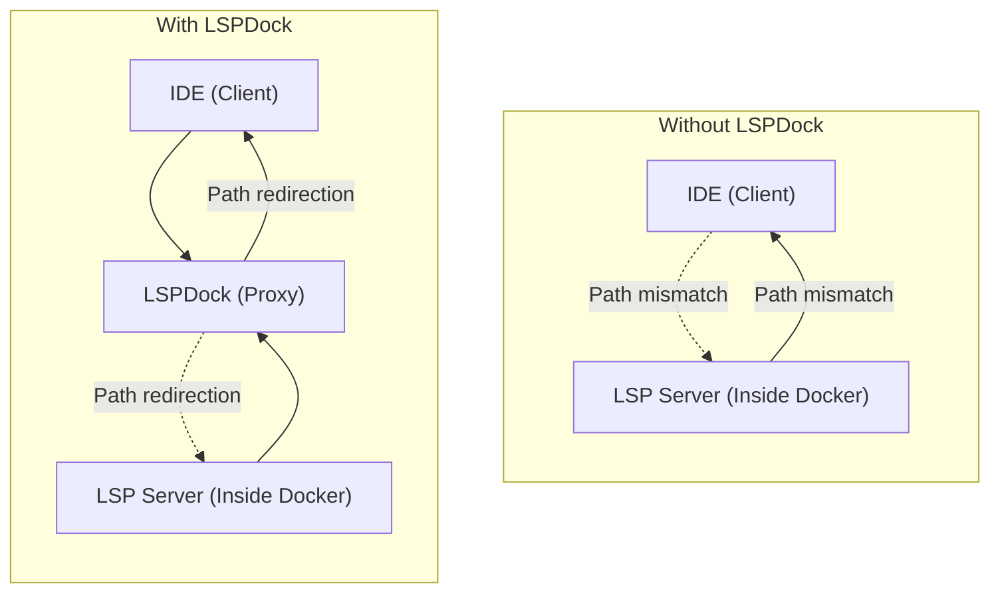

# LSPDock

LSPDock is a lightweight Language Server Protocol (LSP) proxy designed to facilitate communication between IDEs and LSP servers. It supports dynamic path redirection, Docker integration, and configuration-based customization. LSPDock ensures seamless communication between your IDE and LSP server, even when the server is running inside a Docker container.



### Explanation:
1. **Without LSPDock**:
   - The IDE communicates directly with the LSP server inside Docker.
   - Path mismatches between the host and container can cause issues, breaking the communication.

2. **With LSPDock**:
   - LSPDock acts as a middle layer between the IDE and the LSP server.
   - LSPDock dynamically redirects paths, ensuring seamless communication between the IDE and the LSP server inside Docker.

---

## Features

- **Docker Integration**: Supports running LSP servers inside Docker containers.
- **Dynamic Path Redirection**: Automatically adjusts paths between host and container environments.
- **Match container environment**: If a method like `textDocument/definition` points to a third-party library inside a container, that file will be cloned into the local environment, allowing the IDE to navigate to it.
- **Configurable Variables**: Customize paths and behavior using environment variables and configuration files.
- **Logging**: Detailed logs for debugging and monitoring.
- **Fallback**: If cannot attach to Docker, fallback to local environment, this allows use the proxy everywhere

---

## Installation

Download the [release](https://github.com/richardhapb/lspdock/releases) for your system, or build it from source.

## Build from source

### Prerequisites

- **Rust**: Ensure you have Rust installed. You can install it using [rustup](https://rustup.rs/).

### Steps

1. Clone the repository:
   ```bash
   git clone https://github.com/richardhapb/lspdock.git
   cd lspdock
   ```

2. Build the project:
   ```bash
   cargo build --release
   ```

3. Install the binary:
   ```bash
   cp target/release/lspdock /usr/local/bin
   ```

---

## Configuration

The configuration file is optional, in that case, at least the `container`, `docker_internal_path` and `executable` will be passed as a CLI argument. See [CLI arguments](#cli-arguments) for more details.

`LSPDock` uses the following configuration hierarchy: if the top configuration file is present, use that configuration. Use one configuration file at a time. If an option is not present and the next config file contains it, that option will not be used.

```
<project-directory>/lspdock.toml
~/.config/lspdock/lspdock.toml
```

### Example Configuration

```toml
# Path to the Docker container
container = "my-container"

# Path inside the Docker container
docker_internal_path = "/usr/src/app"

# Optional: Path on the host machine, default at the CWD (current working directory)
local_path = "/home/richard/dev/project"

# Optional: Executable for the LSP server
# The priority to resolve the executable name is:
# --exec arg if passed
# proxy binary name, if it is different to lspdock, e.g. if you rename the binary to pyright-langserver, that executable will be used
# executable field in config, this option
#
# Panic if any of them are provided
executable = "pyright-langserver"

# Optional: Pattern to determine whether Docker should be used. If it is not provided, Docker will always be used. If the configuration file is 
# in the project directory, it is a good idea to omit this argument.
pattern = "/home/richard/dev"

# Optional: Controls PID handling for LSP servers that track client processes
# List here your LSP server if it auto-terminates when it can't detect the client process
# For example: pyright-langserver, false for anything else
# The LSPs based on vscode-languageserver-node require this patch because of this implementation: https://github.com/microsoft/vscode-languageserver-node/blob/df56e720c01c6e2d7873733807418f6ce33187ad/server/src/node/main.ts#L80-L106
patch_pid = ["pyright-langserver"]

# Optional: Log level; default is info
log_level = "debug"
```

If the pattern is not present in the current working directory, the proxy acts as the target LSP, without changing anything, and redirects it directly. Also, the logs of the messages continue to be captured and written to the log file.

### Use the proxy as a replacement of the LSP executable

In some circunstances is useful to use LPSDock as a replacement to an original  executable, for example if your IDE allows to indicate the executable to use, you can rename the name of LSPDock to your desired executable, and that name will be used to resolve the executable in Docker. For instance, if you rename the `lspdock` executable to `pyright-langserver`, this last name will be used. If the lspdock has its original name, then the executable indicated in config will be used. In Windows the `.exe` extension will be ignored, that means: `pyright-langserver.exe` resolves to `pyright-langserver`.

### PID Patching Explained

Some LSP servers attempt to monitor the client's process ID (PID) and automatically terminate when they can't detect the client. This behavior can cause problems in containerized environments where PIDs don't match between the host and container.

- **When to use `patch_pid`**:
  - If your LSP server unexpectedly terminates during use
  - For servers like Pyright that actively track the client process
  - When using Docker, where the host PID is not visible inside the container

- **When not to use `patch_pid` or omit:**
  - For LSP servers that don't monitor the client process
  - For servers like Ruff LSP that don't auto-terminate
  - When running LSP servers locally (not in containers)

When `patch_pid` is configured, LSPDock will:
1. Remove the PID from requests to the LSP server
2. Monitor the editor's process itself
3. Properly shut down the LSP server when you close your editor

This feature ensures a smooth experience with LSP servers that would otherwise terminate prematurely when they can't detect your editor's process.

### Handle multiple LSPs

#### Option 1

To handle different LSPs, pass the `--exec` argument to `lspdock`. This argument must be the first and has the following format:

```text
lspdock --exec [executable-name] -- {LSP's arguments}
```

All the arguments passed after `--` will be passed to the LSP.

Examples:

```bash
lspdock --exec pyright-langserver -- --stdio
lspdock --exec ruff -- server
```

To handle this, you should customize your IDE's command to pass the `--exec` argument; this argument will override the `executable` parameter in the config file.

See the [neovim example](nvim_example.md) for a custom use of multiple LSPs using Neovim.


#### Option 2

Rename the `lspdock` executable to the name of your LSP. For example, you can rename `lspdock` to `pyright-langserver`, then the `pyright-langserver` will be used.

### Available Variables

LSPDock supports dynamic variables that can be used in the configuration file:

- **`$CWD`**: Current working directory.
- **`$PARENT`**: Parent directory of the current working directory. For example, `/path/to/project`, where $PARENT resolves to `project`.
- **`$HOME`**: Home directory of the user.

These variables will be automatically expanded when LSPDock reads the configuration file.

#### Example with Variables

```toml
container = "$PARENT-container"
docker_internal_path = "/usr/src/app"
local_path = "$HOME/dev/project"
executable = "rust-analyzer"  # The binary should be in the PATH; otherwise, indicate the absolute path.
pattern = "$HOME/dev"
```

---

## Usage

Refer to the [IDEs configuration guide](ides.md) for detailed configuration steps. For using Neovim you can see the [neovim example](nvim_example.md).

### Running LSPDock

1. Start LSPDock:
   ```bash
   lspdock  # Will be expecting to receive a message from stdin; this should be handled by the IDE
   ```

2. LSPDock will automatically read the configuration file and start the LSP server. If the `pattern` matches the current working directory, LSPDock will use Docker; otherwise, it will run the LSP server directly.

### Logs

Logs are written to a temporary directory. On Unix systems, this is located at `/tmp/lspdock_<binary-name>.log`, and on Windows, it is located at `C:/Windows/Temp`. You can monitor the logs for debugging, for example with rust-analyzer:

```bash
tail -f /tmp/lspdock_rust-analyzer.log
```

## CLI Arguments <a id="cli-arguments"></a>

The following arguments can be used. These arguments take precedence over the config file. If an argument is provided, the config file field (if it exists) will be overridden. All arguments passed after `--` will be forwarded to the LSP. If any of these arguments are included, and the LSP arguments are passed directly, e.g. `lspdock --stdio`, all arguments will be sent directly to the LSP.

**Variable Expansion:** CLI arguments support the same variable expansion as the config file (`$CWD`, `$PARENT`, `$HOME`). Use single quotes to prevent shell expansion:
```bash
lspdock --container '$PARENT-web' --docker-path /app --local-path '$HOME/dev'
```

Without single quotes, your shell will expand the variables before lspdock receives them.

```text
Usage: lspdock [OPTIONS] [-- <ARGS>...]

Arguments:
  [ARGS]...  Arguments to pass to the LSP

Options:
  -c, --container <CONTAINER>      Container for attachment
  -d, --docker-path <DOCKER_PATH>  Docker internal path
  -L, --local-path <LOCAL_PATH>    Local path
  -e, --exec <EXEC>                Executable for the LSP
      --pids <PIDS>                PID patching: indicate the LSPs that require PID patching to null
  -p, --pattern <PATTERN>          Path pattern; this pattern indicates whether Docker will be used. Docker will be used if the current working directory matches the pattern or is a child of it
  -l, --log-level <LOG_LEVEL>      Log level: can be trace, debug, info, warning or error
  -h, --help                       Print help
  -V, --version                    Print version
```

**Why single quotes matter:**
- `"$HOME"` → Shell expands to `/home/user` → lspdock receives `/home/user`
- `'$HOME'` → Shell doesn't expand → lspdock receives `$HOME` → lspdock expands it

Single quotes preserve the literal `$` so lspdock can do the expansion.

### When to Use `--`

Use the `--` separator to avoid ambiguity when your LSP server has flags that conflict with lspdock:

```bash
# Recommended - explicit separation
lspdock --container app-web-1 -- --stdio

# Works only if --stdio doesn't conflict
lspdock --stdio
```

**Conflicting flags:** If your LSP uses `-c`, `-d`, `-L`, `-e`, `-l`, `-p`, or `--pids`, you must use `--` to pass them to the LSP:

```bash
# Ambiguous - lspdock captures -l
lspdock -l debug

# Clear - -l goes to LSP
lspdock -- -l debug
```

**Always use `--` when mixing lspdock and LSP arguments** to follow standard Unix conventions (like `docker run`, `cargo run`).

---

## Road Map

- [x] Generate the configuration hierarchy
- [x] Handle navigating LSP response like `textDocument/definition` in the local environment
- [x] Redirect URIs between Docker container and Host environment
- [x] Implement PID monitoring for the IDE
- [x] Use multiple LSPs in the same project
- [x] Use multiple LSPs in different containers

---

## Troubleshooting

### Common Issues

1. **Configuration File Not Found**:
   Ensure the configuration file exists at `~/.config/lspdock/lspdock.toml`.

2. **Docker Not Found**:
   Install Docker and ensure the target container is running.

---

## Contributing

Contributions are welcome! Feel free to open issues or submit pull requests.

---

## License

This project is licensed under the MIT License.
